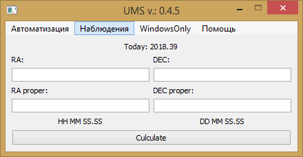

% Наблюдения

----

# Координаты HPMS #

## Описание ##

Модуль позволяет рассчитать новые координаты объекта, основываясь на скорости смещения, указанных в базе Simbad

## Руководство пользователя ##

### Внешний вид модуля ###



### Входные данные ###

**`RA`**: Прямое восхождение объекта в формате: **`HH MM SS.SS`**  
**`DEC`**: Слонение объекта в формате: **`±DD MM SS.SS`**  
**`RA proper`**: Собственное движение по прямому восхождению в mas/year  
**`DEC proper`**:  Собственное движение по склонению в mas/year  

### Порядок действий ###
1. Ввести все необходимые данные
2. Нажать кнопку **"Рассчитать"**
3. Новые координаты появятся сразу над кнопкой

## Алгоритм ##

> Будет описан позднее

## Состав модуля ##

### Используемые библиотеки Python
- datetime
- PyQt5
- sys

### Компоненты модуля
- **w_HPMS.py**: Единственный компонент, включающий в себя и виджет отображения в главном GUI, и алгоритм расчета координат

## Исходный код модулей ###

### w_HPMS.py ###
```python 
from datetime import datetime as dt
from PyQt5.QtCore import *
from PyQt5.QtWidgets import *
from PyQt5.QtGui import *
import sys

class HPMS(QWidget):
    def __init__(self, parent=None):
        QWidget.__init__(self, parent)

        self.main_layout = QGridLayout()
        self.setWindowTitle('HPM stars v 0.2')

        d = dt.now()
        self.diff = (float(d.strftime("%j"))-1) / 366 + float(d.strftime("%Y")) - 2000
        
       #________ Buttons
        self.b_Calc = QPushButton('Расчитать')
        self.b_Calc.clicked.connect(self._Culc)        
        #________ Labels and TextBoxes
        self.today = QLabel('Today: {:.2f}'.format(self.diff + 2000))
        self.today.setAlignment(Qt.AlignCenter)
        self.l_old_ra = QLabel('RA:')
        self.l_old_dec = QLabel('DEC:')
        self.t_old_ra = QLineEdit()
        self.t_old_ra.setFixedWidth(200)
        self.t_old_dec = QLineEdit()
        self.t_old_dec.setFixedWidth(200)        
        self.l_p_ra = QLabel('RA proper:')
        self.l_p_dec = QLabel('DEC proper:')
        self.t_p_ra = QLineEdit()
        self.t_p_dec = QLineEdit()
        self.new_ra = QLabel('HH MM SS.SS')
        self.new_ra.setAlignment(Qt.AlignCenter)
        self.new_dec = QLabel('DD MM SS.SS')
        self.new_dec.setAlignment(Qt.AlignCenter)
        
        #________ Layout
        self.main_layout.addWidget(self.today, 0, 0, 1, 2)
        self.main_layout.addWidget(self.l_old_ra, 1, 0)
        self.main_layout.addWidget(self.l_old_dec, 1, 1)
        self.main_layout.addWidget(self.t_old_ra, 2, 0)
        self.main_layout.addWidget(self.t_old_dec, 2, 1)
        self.main_layout.addWidget(self.l_p_ra, 3, 0)
        self.main_layout.addWidget(self.l_p_dec, 3, 1)
        self.main_layout.addWidget(self.t_p_ra, 4, 0)
        self.main_layout.addWidget(self.t_p_dec, 4, 1)
        self.main_layout.addWidget(self.new_ra, 5, 0)
        self.main_layout.addWidget(self.new_dec, 5, 1)
        self.main_layout.addWidget(self.b_Calc, 6, 0, 1, 2)
        self.setLayout(self.main_layout)
        
    def _Culc(self):
        if self.t_old_dec.text() and self.t_old_ra.text() and self.t_p_dec.text() and self.t_p_ra.text():
            ra = self.t_old_ra.text()
            dec = '%s'%self.t_old_dec.text()
            p_ra = self.t_p_ra.text()
            p_dec = self.t_p_dec.text()

            ra = ra.split()
            dec = dec.split()
            p_ra = self.diff * float(p_ra)/1000
            p_dec = self.diff * float(p_dec)/1000

            ra_h = int(ra[0])
            ra_m = int(ra[1])
            ra_s = float(ra[2])
            ra_in_sec = (ra_h*60+ra_m)*60 + ra_s
            dec_d = int(dec[0])
            dec_m = int(dec[1])
            dec_s = float(dec[2])
            if dec_d<0:
                dec_d = abs(dec_d)
                dec_in_sec = (dec_d*60+dec_m)*60 + dec_s
                dec_in_sec *= -1
            else:
                dec_in_sec = (dec_d*60+dec_m)*60 + dec_s

            new_ra_in_sec = ra_in_sec + p_ra
            new_dec_in_sec = dec_in_sec + p_dec

            new_ra_h = int(ra_in_sec/3600)
            new_ra_m = int((new_ra_in_sec - new_ra_h*3600)/60)
            new_ra_s = (new_ra_in_sec - new_ra_h*3600)%60
            
            new_dec_d = int(dec_in_sec/3600)
            if new_dec_d<0:
                new_dec_m = int((abs(new_dec_in_sec) - abs(new_dec_d*3600))/60)
                new_dec_s = (abs(new_dec_in_sec) - abs(new_dec_d*3600))%60
            else:
                new_dec_m = int((new_dec_in_sec - new_dec_d*3600)/60)
                new_dec_s = (new_dec_in_sec - new_dec_d*3600)%60

            new_ra = '%i %i %.2f'%(new_ra_h, new_ra_m, new_ra_s)
            new_dec = '%i %i %.2f'%(new_dec_d, new_dec_m, new_dec_s)
            self.new_ra.setText(new_ra)
            self.new_dec.setText(new_dec)
```

-----

# Обработка LO #

> На стадии описания

## Описание ##

## Руководство пользователя ##

## Алгоритм ##

## Исходный код ##