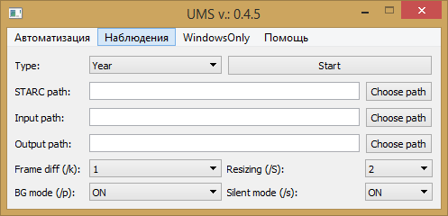

% WindowsOnly

-----

# Расчет СПМ и АКФ #

## Описание ##

Модуль используется для автоматического расчета спектров мощности (СПМ) и автокорелляционных функций (АКФ) с использованием модуля **`spectr.exe`** пакета **`StarC`** по году/сету/ночи наблюдений, или конкретного объекта.

## Руководство пользователя ##

### Внешний вид модуля ###



### Входные данные ###
- **`Type`**: Тип планируемых расчетов. 
- **`STARC path`**: Путь до корневой директории пакета программ StarC
- **`Input path`**: Входная директория для расчетов
- **`Output path`**: Путь сохранения выходных файлов
- **`Frame diff (/k)`**: Влияет на разность кадров. При выборе **`"-1"`** сохранит два типа файлов: с разностью **`"0"`** и **`"1"`**
- **`BG mode (/p)`**: Включение/выключение фонового режима
- **`Resizing (/S)`**: Изменение формата кадра. 1 - 512х512, 2 - 1024х1024 и т.д.
- **`Silent mode (/s)`**: Включение/выключение тихого режима

> В названии некоторых параметров в скобках указан аналог консольного ключа в модуле **`spectr.exe`** пакета **`StarC`**


### Порядок действий ###
1. Выбрать тип входных данных.
2. Указать путь до пакета StarC
3. Указать пути входной директории и директории сохранения
4. Указать необходимые параметры
5. Запустить, нажатием кнопки **"Start"**

## Алгоритм ##

> Будет описан позднее


## 1. Состав модуля

### Используемые библиотеки Python
- PyQt5
- sys
- threading
- ast
- time
- subprocess
- os
- shutil

### Компоненты модуля
- **w_starc_PS.py**: Единственный компонент, включающий в себя и виджет отображения в главном GUI, и алгоритм по-очередного запуска расчета СПМ и АКФ

## Исходный код модулей

### w_starc_PS.py

```python
from PyQt5.QtCore import *
from PyQt5.QtGui import *
from PyQt5.QtWidgets import *
import sys
from threading import Thread, active_count
from ast import literal_eval
from time import sleep
from subprocess import call
from os import walk, makedirs
from os.path import join, isdir, basename
from shutil import copy, move

class starc_PS(QWidget):
    sign_change_progress = pyqtSignal(int, int, str)
    sign_end_of_calc = pyqtSignal()
    def __init__(self, parent = None):
        self.mainGui = parent
        QWidget.__init__(self, parent)

        self.sign_change_progress.connect(self.slot_change_progress)
        self.sign_end_of_calc.connect(self.slot_end_of_calc)
        self.main_layout = QGridLayout()
        
        self.l_Starc = QLabel('STARC path: ')
        self.v_Starc = QLineEdit()
        self.v_Starc.setFixedWidth(300)
        self.b_Starc = QPushButton('Choose path')
        self.b_Starc.clicked.connect(self.c_Starc)

        self.l_Input = QLabel('Input path: ')
        self.v_Input = QLineEdit()
        self.b_Input = QPushButton('Choose path')
        self.b_Input.clicked.connect(self.c_Input)
        
        self.l_Output = QLabel('Output path: ')
        self.v_Output = QLineEdit()
        self.b_Output = QPushButton('Choose path')
        self.b_Output.clicked.connect(self.c_Output)
        
        self.l_Type = QLabel('Type: ')
        self.v_Type = QComboBox()
        self.v_Type.addItems(['Year', 'Set', 'Night', 'Star'])

        self.l_Diff = QLabel('Frame diff (/k): ')
        self.v_Diff = QComboBox()
        self.v_Diff.addItems(['1', '0', '-1', '2', '3', '5', '10', '25', '50', '100'])

        self.l_Size = QLabel('Resizing (/S): ')
        self.v_Size = QComboBox()
        self.v_Size.addItems(['2', '1', '4', '8'])

        self.l_Batch = QLabel('BG mode (/p): ')
        self.v_Batch = QComboBox()
        self.v_Batch.addItems(['ON', 'OFF'])

        self.l_Silent = QLabel('Silent mode (/s): ')
        self.v_Silent = QComboBox()
        self.v_Silent.addItems(['ON', 'OFF'])

        self.b_Start = QPushButton('Start')
        self.b_Start.clicked.connect(self.c_Start)

        self.PB = QProgressBar()
        self.PB.setValue(0)
        self.PB.hide()

        self.msg = QLabel('Collecting... ')
        self.msg.setAlignment(Qt.AlignCenter)
        self.msg.hide()
        
        self.main_layout.addWidget(self.l_Type, 0, 0)
        self.main_layout.addWidget(self.v_Type, 0, 1)
        self.main_layout.addWidget(self.b_Start, 0, 2, 1, 2)        
        self.main_layout.addWidget(self.l_Starc, 1, 0)
        self.main_layout.addWidget(self.v_Starc, 1, 1, 1, 2)
        self.main_layout.addWidget(self.b_Starc, 1, 3)
        self.main_layout.addWidget(self.l_Input, 2, 0)
        self.main_layout.addWidget(self.v_Input, 2, 1, 1, 2)
        self.main_layout.addWidget(self.b_Input, 2, 3)
        self.main_layout.addWidget(self.l_Output, 3, 0)
        self.main_layout.addWidget(self.v_Output, 3, 1, 1, 2)
        self.main_layout.addWidget(self.b_Output, 3, 3)
        self.main_layout.addWidget(self.l_Diff, 4, 0)
        self.main_layout.addWidget(self.v_Diff, 4, 1)
        self.main_layout.addWidget(self.l_Size, 4, 2)
        self.main_layout.addWidget(self.v_Size, 4, 3)
        self.main_layout.addWidget(self.l_Batch, 5, 0)
        self.main_layout.addWidget(self.v_Batch, 5, 1)
        self.main_layout.addWidget(self.l_Silent, 5, 2)
        self.main_layout.addWidget(self.v_Silent, 5, 3)
        self.main_layout.addWidget(self.PB, 6, 0, 1, 4)
        self.main_layout.addWidget(self.msg, 6, 0, 1, 4)

        self.setLayout(self.main_layout)

    def c_Input(self):
        if self.v_Type.currentText().lower() == 'star':
            self.v_Input.setText(QFileDialog.getOpenFileName(self, 'Select Input Dat File', '.', "DAT (*.dat)")[0])
        else:
            self.v_Input.setText(QFileDialog.getExistingDirectory(self, "Select Input Directory", '.', QFileDialog.ShowDirsOnly))

    def c_Output(self):
        self.v_Output.setText(QFileDialog.getExistingDirectory(self, "Select Output Directory", '.', QFileDialog.ShowDirsOnly))

    def c_Starc(self):
        self.v_Starc.setText(QFileDialog.getExistingDirectory(self, "Select Output Directory", '.', QFileDialog.ShowDirsOnly))
        
    def c_Start(self):
        self.PB.show()
        self.msg.show()
        self.params = {}
        self.params['basepath'] = self.v_Input.text()
        self.params['work'] = []
        self.th = Thread(target = self.process)
        self.th.start()
        self.b_Start.setEnabled(False)
    
    def slot_change_progress(self, v, max_v, text):
        if not self.PB.maximum == max_v:
            self.PB.setMaximum(max_v)
            self.PB.setValue(0)
        self.PB.setValue(v)
        self.msg.setText(text)
    
    def slot_end_of_calc(self):
        self.b_Start.setEnabled(True)
        self.msg.setText('Finished')
        
    def process(self):
        if self.v_Type.currentText().lower() == 'year':
            self.scan_year()
        elif self.v_Type.currentText().lower() == 'set':
            self.scan_set()
        elif self.v_Type.currentText().lower() == 'night':
            self.scan_night()
        elif self.v_Type.currentText().lower() == 'star':
            pass
        self.sign_change_progress.emit(0, len(self.params['work']), 'Ready to calculate.')
        self.calc_PS()
        self.sign_end_of_calc.emit()

    def scan_year(self):
        self.params['sets'] = {}
        self.params['sets']['paths'] = list(walk(self.params['basepath']))[0][1]
        self.scan_set()

    def scan_set(self):
        if 'sets' in self.params:
            for p_set in self.params['sets']['paths']:
                self.params['sets'][p_set] = {}
                if isdir(join(self.params['basepath'], p_set, 'cut')): subdir = 'cut'
                elif isdir(join(self.params['basepath'], p_set, 'rebuild')): subdir = 'rebuild'
                elif isdir(join(self.params['basepath'], p_set, 'rebuilded')): subdir = 'rebuilded'
                for root, dirs, files in walk(join(self.params['basepath'], p_set, subdir)):
                    self.params['sets'][p_set]['nights'] = [join(subdir, d) for d in dirs]                    
                    break
        else:
            if isdir(join(self.params['basepath'], 'cut')): subdir = 'cut'
            elif isdir(join(self.params['basepath'], 'rebuild')): subdir = 'rebuild'
            elif isdir(join(self.params['basepath'], 'rebuilded')): subdir = 'rebuilded'
            self.params['nights'] = [join(subdir, p) for p in list(walk(join(self.params['basepath'], subdir)))[0][1]]
        self.scan_night()

    def scan_night(self):
        for i in self.params:
            print(self.params[i])    
        if 'sets' in self.params:
            for p_set in self.params['sets']['paths']:
                for night in self.params['sets'][p_set]['nights']:
                    for root, dirs, files in walk(join(self.params['basepath'], p_set, night)):
                        for f in files:
                            if f.endswith('.dat') and not f.startswith('dark') and not f.startswith('flat') and not f.endswith('moon.dat'):
                                self.params['work'].append(join(self.params['basepath'], p_set, night, f))
        elif 'nights' in self.params:
            for night in self.params['nights']:
                for root, dirs, files in walk(join(self.params['basepath'], night)):
                    for f in files:
                        if f.endswith('.dat') and not f.startswith('dark') and not f.startswith('flat') and not f.endswith('moon.dat'):
                            self.params['work'].append(join(self.params['basepath'], night, f))
        else:   
            for root, dirs, files in walk(self.params['basepath']):
                for f in files:
                    if f.endswith('.dat') and not f.startswith('dark') and not f.startswith('flat') and not f.endswith('moon.dat'):
                        self.params['work'].append(join(self.params['basepath'], f))
    
    def calc_PS(self):
        i = 0
        for star in self.params['work']:
            i+=1
            self.sign_change_progress.emit(i, len(self.params['work']), star)
            if self.v_Silent.currentText() == 'ON':
                self.silent = '/s'
            else:
                self.silent = ''
            if self.v_Batch.currentText() == 'ON':
                self.batch = '/p'
            else:
                self.batch = ''

            if self.v_Type.currentText().lower() == 'star':
                output_path = self.v_Output.text()
            elif self.v_Type.currentText().lower() == 'night':
                output_path = join(self.v_Output.text(), star.split('\\')[-2])                
            elif self.v_Type.currentText().lower() == 'set':
                output_path = join(self.v_Output.text(), star.split('\\')[-2])
            elif self.v_Type.currentText().lower() == 'year':
                output_path = join(self.v_Output.text(), star.split('\\')[-4], star.split('\\')[-2])
            try:
                makedirs(output_path)
            except:
                pass
            copy(join(self.v_Starc.text(), 'DATA', 'file.xfs'), star+'.xfs')
            call([join(self.v_Starc.text(), 'spectr.exe'), star, '/k {}'.format(self.v_Diff.currentText()), '/S {}'.format(self.v_Size.currentText()), self.silent, self.batch])
            move(join(self.v_Starc.text(), 'SPECTR', '{}x'.format(self.v_Size.currentText()), 'VIS', basename(star)+'.spectr.[1]acf.dat'), join(output_path, basename(star)+'ACF.dat')) 
            move(join(self.v_Starc.text(), 'SPECTR', '{}x'.format(self.v_Size.currentText()), 'VIS', basename(star)+'.spectr.[1]acf.%dat'), join(output_path, basename(star)+'ACF.%dat')) 
            move(join(self.v_Starc.text(), 'SPECTR', '{}x'.format(self.v_Size.currentText()), 'VIS', basename(star)+'.spectr.[1]sw4.dat'), join(output_path, basename(star)+'PS.dat')) 
            move(join(self.v_Starc.text(), 'SPECTR', '{}x'.format(self.v_Size.currentText()), 'VIS', basename(star)+'.spectr.[1]sw4.%dat'), join(output_path, basename(star)+'PS.%dat'))      
```

-----

# Расчет масок #

> На стадии описания

## Описание ##

## Руководство пользователя ##

## Алгоритм ##

## Исходный код ##